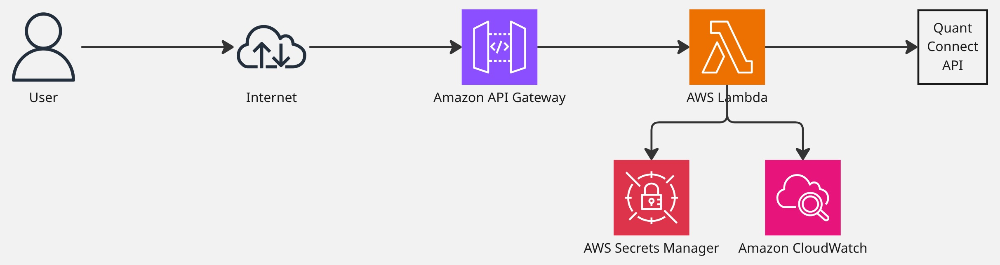

# QuantConnect MCP Server

Model Context Protocol server for AI assistants to interact with QuantConnect's algorithmic trading platform.

<div align="center">
   
</div>

## Overview

Bridge between AI assistants and QuantConnect platform for:
- Algorithm development and management
- Backtesting and live trading deployment
- Data management and research tools
- Project collaboration and optimization

## Architecture

The project follows a monorepo structure with multiple specialized packages:

```
aws-lambda-mcp/
├── libs/                           # Core libraries
│   ├── quant-connect-mcp/         # Main MCP server implementation
│   ├── quant-connect-types/       # TypeScript types from QuantConnect API
│   ├── quant-connect-client/      # HTTP client for QuantConnect API
│   └── middy/                     # AWS Lambda middleware integration
├── services/                      # Deployable services
│   ├── quant-connect/            # Main Lambda service
│   └── quant-connect-local/      # Local development service
└── infra/                        # AWS CDK infrastructure
```

### Core Components

- **MCP Server**: Model Context Protocol implementation ([docs](libs/quant-connect-mcp/README.md))
- **QuantConnect Client**: HTTP client for QuantConnect API ([docs](libs/quant-connect-client/README.md))
- **AWS Lambda**: Serverless deployment ([docs](services/quant-connect/README.md))
- **Type Safety**: Auto-generated TypeScript types ([docs](libs/quant-connect-types/README.md))

> **Note**: Uses modified OpenAPI spec to fix validation issues in the official specification.

## vs Official QuantConnect MCP Server

Alternative to [official MCP server](https://github.com/QuantConnect/mcp-server) with key differences:

### Architecture
| Feature | This Implementation | Official Server |
|---------|-------------------|-----------------|
| **Language** | TypeScript/Node.js | Python |
| **Deployment** | AWS Lambda + API Gateway | Docker container |
| **Runtime** | Serverless | Container-based |
| **Scaling** | Auto-scaling Lambda | Manual container scaling |
| **Infrastructure** | AWS CDK (Infrastructure as Code) | Docker Compose/Kubernetes |

### Tools
| Category | This Implementation | Official Server |
|----------|-------------------|-----------------|
| **Total Tools** | 50+ tools | 64 tools |
| **Project Management** | ✅ Full support | ✅ Full support |
| **File Operations** | ✅ Full support | ✅ Full support + `patch_file` |
| **Backtesting** | ✅ Full support | ✅ Full support |
| **Live Trading** | ✅ Full support | ✅ Full support |
| **AI Tools** | ✅ Full support | ✅ Full support |
| **Optimization** | ✅ Full support | ✅ Full support |
| **Object Store** | ✅ Full support | ✅ Full support |

### Key Differences

**Missing Features:**
- `patch_file` tool (git-style patches)
- `authorize_connection` tool (two-step live auth)

**Unique Features:**
- AWS cloud integration (Lambda, API Gateway, Secrets Manager, CloudWatch)
- Infrastructure as Code (CDK)
- Full TypeScript type safety
- Local development server
- Built-in monitoring and authentication

### Development
| Aspect | This Implementation | Official Server |
|--------|-------------------|-----------------|
| **Setup** | Node.js ecosystem | Python ecosystem |
| **Type Safety** | Full TypeScript + Zod validation | Python type hints |
| **Testing** | Jest + comprehensive test suite | Python testing framework |
| **Documentation** | Extensive MD docs + API reference | README + inline docs |
| **Local Development** | HTTP server + hot reloading | Python STDIO + inspector |
| **IDE Support** | Full IntelliSense + autocomplete | Python IDE support |

### Production
| Factor | This Implementation | Official Server |
|--------|-------------------|-----------------|
| **Security** | AWS IAM + API Gateway auth | Container security |
| **Monitoring** | CloudWatch logs + metrics | Container logging |
| **Cost** | Pay-per-request (serverless) | Fixed container costs |
| **Maintenance** | Managed AWS services | Container updates needed |
| **Reliability** | AWS SLA (99.95%+) | Container orchestration dependent |
| **Global Distribution** | Multi-region AWS deployment | Manual geographic deployment |

### When to Choose

**This implementation:**
- TypeScript/Node.js preference
- Serverless deployment
- AWS integration
- Type safety focus

**Official implementation:**
- Python preference  
- Docker deployment
- Need `patch_file` tool
- Direct QC support

## Features

50+ tools covering:
- **Projects**: Create, manage, and collaborate on QuantConnect projects
- **Files**: Read, write, and organize algorithm files
- **Backtesting**: Historical simulations with analytics
- **Live Trading**: Deploy with risk controls
- **AI Tools**: Code completion, error enhancement, syntax checking
- **Optimization**: Parameter tuning and strategy optimization
- **Research**: Data access and object storage
- **Account**: User management and monitoring

## Quick Start

**Prerequisites:** Node.js 18+, QuantConnect account

```bash
# Install
git clone <repository-url>
cd aws-lambda-mcp
npm ci
npm run build

# Local development
cd services/quant-connect-local
npm start

# AWS deployment (requires AWS CLI)
# 1. Initial deployment (creates empty secrets):
cd infra && npm run deploy

# 2. Populate secrets with actual QuantConnect credentials:
aws secretsmanager update-secret \
  --secret-id "quant-connect-mcp/user-id" \
  --secret-string "your-quantconnect-user-id"
aws secretsmanager update-secret \
  --secret-id "quant-connect-mcp/api-token" \
  --secret-string "your-quantconnect-api-token"
```

## Configuration

**Local:** Set `QC_USER_ID` and `QC_API_TOKEN` environment variables  
**AWS:** Creates API Gateway, Lambda, CloudWatch logs, Secrets Manager

### MCP Protocol Support

This implementation includes enhanced MCP protocol support:

- **Full JSON-RPC 2.0 compliance** with proper request/response handling
- **Notification support** for MCP client handshake (initialize/initialized flow)
- **Streaming transport compatibility** with AWS Lambda/API Gateway
- **Error handling** with appropriate HTTP status codes

See [API Documentation](docs/api.md) for complete tool reference.

## Documentation

### Complete Documentation Guide

- **[API Reference](docs/api.md)** - Complete MCP tools and API documentation
- **[Development Guide](docs/DEVELOPMENT.md)** - Development setup, debugging, and best practices
- **[Contributing Guidelines](docs/CONTRIBUTING.md)** - How to contribute, coding standards, and release process

### Package Documentation

#### Core Libraries
- **[QuantConnect MCP Server](libs/quant-connect-mcp/README.md)** - Main MCP server implementation with 50+ tools
- **[QuantConnect Types](libs/quant-connect-types/README.md)** - Auto-generated TypeScript types from OpenAPI specification
- **[QuantConnect Client](libs/quant-connect-client/README.md)** - HTTP client library for QuantConnect API
- **[Middy Integration](libs/middy/README.md)** - AWS Lambda middleware for MCP server

#### Services
- **[AWS Lambda Service](services/quant-connect/README.md)** - Production serverless deployment
- **[Local Development Service](services/quant-connect-local/README.md)** - Local HTTP server for development

#### Infrastructure
- **[AWS CDK Infrastructure](infra/README.md)** - Complete AWS deployment stack with CDK

## Development

Monorepo with independent packages. See [Development Guide](docs/DEVELOPMENT.md) for setup details.

```bash
npm run lint        # Code linting
npm run build       # Build all packages  
npm test           # Run unit tests across all packages
npm run test:e2e   # Run end-to-end tests (requires deployed server)
```

### Testing

The project includes comprehensive testing at multiple levels:

- **Unit Tests**: 100% coverage for all TypeScript files
- **Integration Tests**: Component interaction validation
- **E2E Tests**: Real server testing with AWS authentication

```bash
# Run all tests
npm test

# Run tests with coverage
npm run test:coverage

# Run E2E tests (requires environment variables)
cd e2e && npm run test:e2e
```

## Security

- AWS Secrets Manager for credentials
- API Gateway authentication and rate limiting  
- Zod input validation

## Acknowledgments

This project's Middy MCP integration is inspired by the [`middy-mcp`](https://github.com/fredericbarthelet/middy-mcp) package by Frédéric Barthelet. While our implementation is independently developed with different architectural choices, we acknowledge the foundational work done by the `middy-mcp` community in establishing patterns for MCP server integration with AWS Lambda.

## License

This project is licensed under the MIT License - see the [LICENSE](LICENSE) file for details.

## Support

- [QuantConnect Docs](https://quantconnect.com/docs)
- [MCP Specification](https://modelcontextprotocol.io)
- Report issues via GitHub

