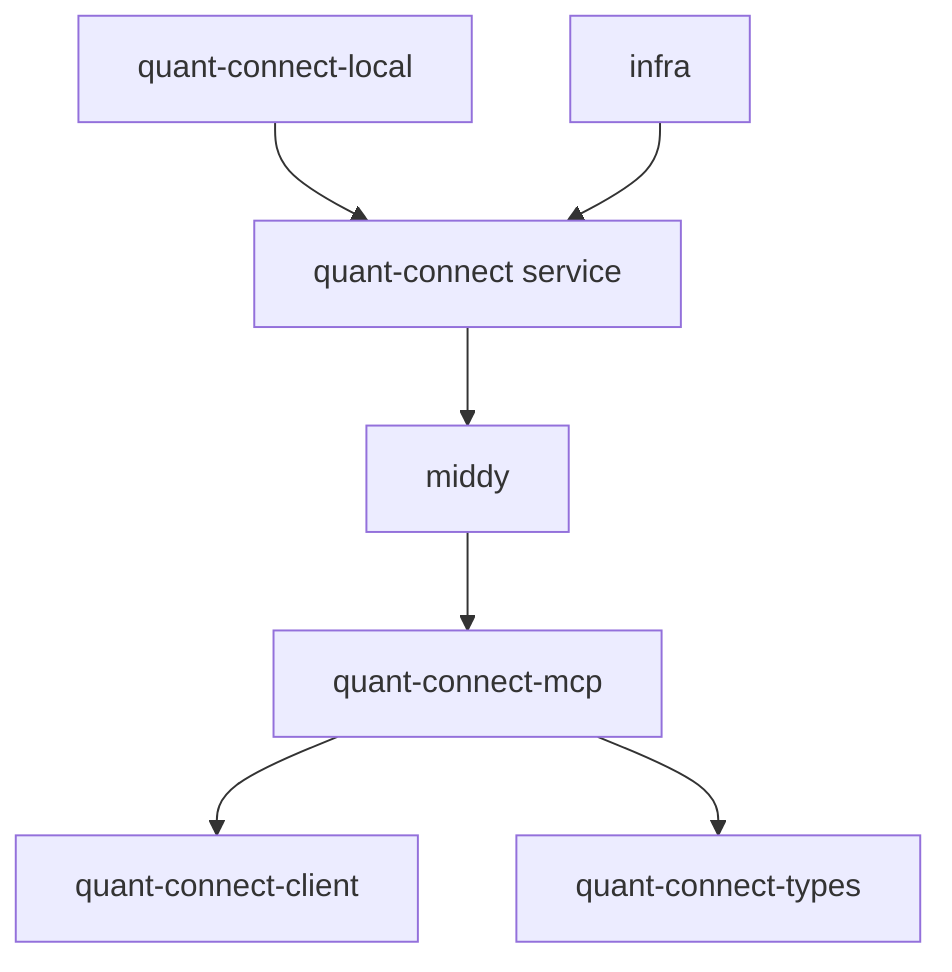

# Contributing to QuantConnect MCP Server

Thank you for your interest in contributing to the QuantConnect MCP Server! This guide will help you get started with development, testing, and submitting contributions.

## Table of Contents

- [Development Setup](#development-setup)
- [Project Structure](#project-structure)
- [Development Workflow](#development-workflow)
- [Coding Standards](#coding-standards)
- [Testing](#testing)
- [Documentation](#documentation)
- [Submitting Changes](#submitting-changes)
- [Release Process](#release-process)

## Development Setup

### Prerequisites

- **Node.js 18+**: Required for all development
- **npm**: Package manager (comes with Node.js)
- **Git**: Version control
- **AWS CLI**: For deployment and testing (optional)
- **QuantConnect Account**: With API access for testing

### Initial Setup

1. **Fork and clone the repository**:
   ```bash
   git clone https://github.com/your-username/aws-lambda-mcp.git
   cd aws-lambda-mcp
   ```

2. **Install dependencies**:
   ```bash
   npm ci
   ```

3. **Generate TypeScript types**:
   ```bash
   cd libs/quant-connect-types
   npm run build
   cd ../..
   ```

4. **Set up environment variables**:
   ```bash
   # Copy example environment file
   cp .env.example .env
   
   # Edit with your QuantConnect credentials
   vim .env
   ```

5. **Build all packages**:
   ```bash
   # Build all packages
   npm run build
   
   # Or build specific packages
   cd libs/quant-connect-mcp
   npm run build
   ```

### Environment Configuration

Create a `.env` file in the project root:

```bash
# QuantConnect API Credentials
QUANTCONNECT_USER_ID=your-quantconnect-user-id
QUANTCONNECT_API_TOKEN=your-quantconnect-api-token

# Development Settings
NODE_ENV=development
LOG_LEVEL=debug
DEBUG=quant-connect:*

# Local Server Settings (for quant-connect-local service)
PORT=55555
HOST=0.0.0.0
```

### IDE Setup

#### Visual Studio Code

Recommended extensions:
- TypeScript and JavaScript Language Features
- ESLint
- Prettier
- AWS Toolkit

#### Settings

Add to `.vscode/settings.json`:

```json
{
  "editor.formatOnSave": true,
  "editor.codeActionsOnSave": {
    "source.fixAll.eslint": true,
    "source.organizeImports": true
  },
  "typescript.preferences.importModuleSpecifier": "relative",
  "files.exclude": {
    "**/node_modules": true,
    "**/dist": true,
    "**/*.js": {
      "when": "$(basename).ts"
    }
  }
}
```

## Project Structure

The project follows a monorepo structure with workspaces:

```
aws-lambda-mcp/
├── libs/                           # Reusable libraries
│   ├── quant-connect-mcp/         # Main MCP server implementation
│   ├── quant-connect-types/       # Generated TypeScript types
│   ├── quant-connect-client/      # HTTP client for QuantConnect API
│   └── middy/                     # AWS Lambda middleware
├── services/                      # Deployable services
│   ├── quant-connect/            # AWS Lambda service
│   └── quant-connect-local/      # Local development service
├── infra/                        # AWS CDK infrastructure
├── docs/                         # Documentation
└── scripts/                      # Build and utility scripts
```

### Package Dependencies



## Development Workflow

### Local Development

1. **Start the local MCP server**:
   ```bash
   cd services/quant-connect-local
   npm start
   ```

2. **Test with curl**:
   ```bash
   curl -X POST http://localhost:55555/mcp \
     -H "Content-Type: application/json" \
     -d '{"jsonrpc":"2.0","id":1,"method":"read_infra_health"}'
   ```

3. **Hot reloading** (optional):
   ```bash
   npm install -g nodemon
   cd services/quant-connect-local
   nodemon --watch ../.. --ext ts,js src/index.ts
   ```

### Adding New Tools

1. **Define the tool** in the appropriate category file:
   ```typescript
   // libs/quant-connect-mcp/src/tools/my-category-tools.ts
   export const getMyCategoryToolsDefinitions: ToolRegistrationDefinitions<MY_TOOL_KEYS> = {
     [MY_TOOL_KEYS.MY_NEW_TOOL]: {
       config: {
         title: 'My New Tool',
         description: 'Description of what the tool does',
         inputSchema: {
           param1: z.string().describe('Parameter description'),
           param2: z.number().optional(),
         },
         outputSchema: {
           result: z.string(),
         },
         annotations: {
           readOnlyHint: true,
           destructiveHint: false,
           idempotentHint: true,
         },
       },
       url: '/api/v2/my-endpoint', // For API tools
       // OR
       func: async (params) => {
         // Custom function implementation
         return { result: 'success' }
       },
     },
   }
   ```

2. **Add tool keys**:
   ```typescript
   // libs/quant-connect-mcp/src/tools/tool-keys.ts
   export enum MY_TOOL_KEYS {
     MY_NEW_TOOL = 'my_new_tool',
   }
   ```

3. **Register the tools**:
   ```typescript
   // libs/quant-connect-mcp/src/tools/index.ts
   const definitions: ToolRegistrationDefinitions<TOOL_KEYS> = {
     ...getMyCategoryToolsDefinitions,
     // ... other tool definitions
   }
   ```

4. **Update type exports**:
   ```typescript
   // libs/quant-connect-mcp/src/tools/tool-keys.ts
   export type TOOL_KEYS =
     | MY_TOOL_KEYS
     | OTHER_TOOL_KEYS
   ```

### Testing Changes

1. **Unit tests**:
   ```bash
   npm test
   ```

2. **Integration tests**:
   ```bash
   cd services/quant-connect-local
   npm test
   ```

3. **Manual testing**:
   ```bash
   # Start local server
   npm run dev:local
   
   # Test new tool
   curl -X POST http://localhost:55555/mcp \
     -H "Content-Type: application/json" \
     -d '{
       "jsonrpc": "2.0",
       "id": 1,
       "method": "tools/call",
       "params": {
         "name": "my_new_tool",
         "arguments": {
           "param1": "test value"
         }
       }
     }'
   ```

## Coding Standards

### TypeScript

- Use strict TypeScript configuration
- Prefer interfaces over types for object shapes
- Use explicit return types for public functions
- Avoid `any` - use proper typing

```typescript
// Good
interface ProjectCreateParams {
  name: string
  language?: 'Py' | 'C#'
  description?: string
}

async function createProject(params: ProjectCreateParams): Promise<Project> {
  // implementation
}

// Avoid
function createProject(params: any): any {
  // implementation
}
```

### Code Organization

- One class/interface per file
- Group related functionality in directories
- Use barrel exports (`index.ts`) for clean imports
- Keep functions focused and single-purpose

### Naming Conventions

- **Files**: `kebab-case.ts`
- **Classes**: `PascalCase`
- **Functions/Variables**: `camelCase`
- **Constants**: `UPPER_SNAKE_CASE`
- **Interfaces**: `PascalCase` (no `I` prefix)
- **Types**: `PascalCase`

```typescript
// Good
class QuantConnectClient {
  private readonly baseUrl: string
  
  async createProject(params: ProjectCreateParams): Promise<Project> {
    // implementation
  }
}

const API_BASE_URL = 'https://www.quantconnect.com/api'
```

### Error Handling

- Use specific error types
- Provide meaningful error messages
- Include context in error data

```typescript
class QuantConnectAPIError extends Error {
  constructor(
    message: string,
    public statusCode: number,
    public response?: any
  ) {
    super(message)
    this.name = 'QuantConnectAPIError'
  }
}

// Usage
if (response.status !== 200) {
  throw new QuantConnectAPIError(
    `API request failed: ${response.statusText}`,
    response.status,
    response.data
  )
}
```

### Documentation

- Use JSDoc for all public APIs
- Include examples for complex functions
- Document parameter constraints and return values

```typescript
/**
 * Creates a new QuantConnect project
 * 
 * @param params - Project creation parameters
 * @param params.name - Project name (max 100 characters)
 * @param params.language - Programming language (default: 'Py')
 * @param params.description - Optional project description
 * @returns Promise resolving to the created project
 * 
 * @example
 * ```typescript
 * const project = await createProject({
 *   name: 'My Algorithm',
 *   language: 'Py',
 *   description: 'A momentum trading strategy'
 * })
 * ```
 */
async function createProject(params: ProjectCreateParams): Promise<Project> {
  // implementation
}
```

## Testing

### Test Structure

```
src/
├── __tests__/
│   ├── unit/              # Unit tests
│   ├── integration/       # Integration tests
│   └── fixtures/          # Test data and mocks
```

### Writing Tests

Use Jest for testing:

```typescript
// libs/quant-connect-mcp/src/__tests__/unit/server.test.ts
import { QCMCPServer } from '../../server'

describe('QCMCPServer', () => {
  let server: QCMCPServer

  beforeEach(() => {
    server = QCMCPServer.getInstance()
  })

  it('should provide health check', async () => {
    const response = await server.call('read_infra_health')
    expect(response.structuredContent.healthStatus).toBe('ok')
  })

  it('should return server version', async () => {
    const response = await server.call('read_mcp_server_version')
    expect(response.structuredContent.version).toMatch(/^\d+\.\d+\.\d+$/)
  })
})
```

### Test Categories

1. **Unit Tests**: Test individual functions and classes (100% coverage required)
2. **Integration Tests**: Test component interactions
3. **E2E Tests**: Test complete workflows against deployed infrastructure
4. **API Tests**: Test against QuantConnect API (with mocks)

### Testing Requirements

All contributions must include comprehensive tests:

- **100% Code Coverage**: Every TypeScript file must have corresponding tests
- **All Branches Covered**: Test both success and error paths
- **Mocking Strategy**: Mock external dependencies (QCClient, AWS services)
- **Type Safety**: Use proper TypeScript types in tests
- **Performance**: Include performance assertions for critical paths

### Mocking

Mock external dependencies:

```typescript
// Mock QuantConnect API
jest.mock('@fschaeffler/quant-connect-client', () => ({
  QCClient: {
    getInstance: () => ({
      post: jest.fn().mockResolvedValue({
        projectId: 12345,
        name: 'Test Project'
      })
    })
  }
}))
```

### Running Tests

```bash
# All unit tests
npm test

# All tests with coverage (must be 100%)
npm run test:coverage

# Specific package
cd libs/quant-connect-mcp
npm test

# Watch mode during development
npm test -- --watch

# E2E tests (requires deployed infrastructure)
cd e2e && npm run test:e2e

# Test specific file
npm test -- src/tools/my-tool.test.ts
```

### Test Quality Standards

#### Unit Test Example

```typescript
// libs/quant-connect-mcp/src/tools/my-tool.test.ts
import { getMyToolDefinitions } from './my-tool'
import { QCClient } from '@fschaeffler/quant-connect-client'

// Mock dependencies
jest.mock('@fschaeffler/quant-connect-client')
const MockedQCClient = jest.mocked(QCClient)

describe('MyTool', () => {
  let mockQCClientInstance: jest.Mocked<QCClient>

  beforeEach(() => {
    jest.clearAllMocks()
    mockQCClientInstance = { post: jest.fn() } as any
    MockedQCClient.getInstance.mockReturnValue(mockQCClientInstance)
  })

  it('should execute tool successfully', async () => {
    const mockResponse = { success: true, data: 'test' }
    mockQCClientInstance.post.mockResolvedValue(mockResponse)

    const tool = getMyToolDefinitions['MY_TOOL']
    if ('func' in tool) {
      const result = await tool.func({ param: 'test' })
      expect(result).toEqual(mockResponse)
    }
  })

  it('should handle API errors gracefully', async () => {
    const apiError = new Error('API Error')
    mockQCClientInstance.post.mockRejectedValue(apiError)

    const tool = getMyToolDefinitions['MY_TOOL']
    if ('func' in tool) {
      await expect(tool.func({ param: 'test' })).rejects.toThrow('API Error')
    }
  })

  // Test all branches, edge cases, and error conditions...
})
```

#### E2E Test Requirements

E2E tests must validate real deployment scenarios:

```typescript
// e2e/src/feature.test.ts
describe('Feature E2E Tests', () => {
  // Test against real AWS infrastructure
  // Validate complete workflows
  // Include performance benchmarks
  // Test error scenarios
})
```

## Documentation

### README Files

Each package should have a comprehensive README:

- Purpose and overview
- Installation and setup
- Usage examples
- API reference
- Contributing guidelines

### API Documentation

Document all MCP tools in `docs/api.md`:

- Tool description and purpose
- Input parameters with types
- Output format
- Usage examples
- Error conditions

### Code Comments

- Comment complex business logic
- Explain non-obvious design decisions
- Document assumptions and constraints
- Use TODO comments for future improvements

```typescript
/**
 * Injects code source identification for tracking purposes.
 * This is required by QuantConnect for audit trails and debugging.
 * 
 * TODO: Consider making this configurable per tool
 */
function injectCodeSourceId(schema: ZodRawShape): void {
  // implementation
}
```

## Submitting Changes

### Before Submitting

1. **Run linting**:
   ```bash
   npm run lint
   npm run lint:fix
   ```

2. **Run tests**:
   ```bash
   npm test
   ```

3. **Build all packages**:
   ```bash
   npm run build
   ```

4. **Update documentation** if needed

### Commit Messages

Follow conventional commit format:

```
type(scope): description

[optional body]

[optional footer]
```

**Types**:
- `feat`: New feature
- `fix`: Bug fix
- `docs`: Documentation changes
- `style`: Code style changes (formatting, etc.)
- `refactor`: Code refactoring
- `test`: Adding or updating tests
- `chore`: Maintenance tasks

**Examples**:
```
feat(mcp): add new optimization tool
fix(client): handle timeout errors gracefully
docs(api): update tool examples
test(server): add integration tests for live tools
```

### Pull Request Process

1. **Create a feature branch**:
   ```bash
   git checkout -b feature/my-new-feature
   ```

2. **Make your changes** following the guidelines above

3. **Commit your changes**:
   ```bash
   git add .
   git commit -m "feat(mcp): add new optimization tool"
   ```

4. **Push to your fork**:
   ```bash
   git push origin feature/my-new-feature
   ```

5. **Create a pull request** with:
   - Clear title and description
   - Reference to related issues
   - Testing instructions
   - Screenshots (if UI changes)

### Pull Request Template

```markdown
## Description
Brief description of changes

## Type of Change
- [ ] Bug fix
- [ ] New feature
- [ ] Breaking change
- [ ] Documentation update

## Testing
- [ ] Unit tests pass
- [ ] Integration tests pass
- [ ] Manual testing completed

## Checklist
- [ ] Code follows style guidelines
- [ ] Self-review completed
- [ ] Documentation updated
- [ ] No lint errors
```

## Release Process

### Versioning

We follow [Semantic Versioning](https://semver.org/):

- **MAJOR**: Breaking changes
- **MINOR**: New features (backward compatible)
- **PATCH**: Bug fixes (backward compatible)

### Release Steps

1. **Update version numbers** in all `package.json` files
2. **Create release branch**:
   ```bash
   git checkout -b release/1.2.0
   ```
4. **Run full test suite**
5. **Build and test deployment**
6. **Create release tag**:
   ```bash
   git tag -a v1.2.0 -m "Release version 1.2.0"
   ```
7. **Push tag and merge to main**


## Community Guidelines

### Code of Conduct

- Be respectful and inclusive
- Focus on constructive feedback
- Help newcomers learn and contribute
- Report inappropriate behavior

### Getting Help

- **Issues**: Create GitHub issues for bugs and feature requests
- **Discussions**: Use GitHub Discussions for questions
- **Documentation**: Check existing docs before asking questions
- **Community**: Join QuantConnect forums for general discussion

### Recognition

Contributors are recognized in:
- Release notes
- Project documentation
- Annual contributor reports

Thank you for contributing to the QuantConnect MCP Server! Your contributions help make algorithmic trading more accessible to developers worldwide.
