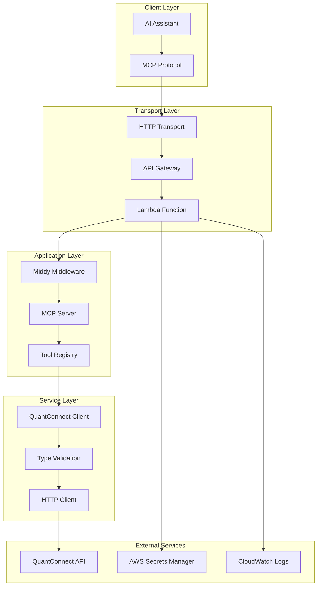

# Development Guide

Comprehensive guide for developing with the QuantConnect MCP Server project.

## Table of Contents

- [Quick Start](#quick-start)
- [Architecture Overview](#architecture-overview)
- [Local Development](#local-development)
- [Testing Strategies](#testing-strategies)
- [Debugging](#debugging)
- [Performance Optimization](#performance-optimization)
- [Deployment](#deployment)
- [Troubleshooting](#troubleshooting)

## Quick Start

### 1-Minute Setup

```bash
# Clone and install
git clone <repository-url>
cd aws-lambda-mcp
npm ci

# Build all packages
npm run build

# Set up environment
echo "QC_USER_ID=your-user-id" > .env
echo "QC_API_TOKEN=your-api-token" >> .env

# Start local server
cd services/quant-connect-local
npm start

# Test in another terminal
curl -X POST http://localhost:55555/mcp \
  -H "Content-Type: application/json" \
  -d '{"jsonrpc":"2.0","id":1,"method":"read_infra_health"}'
```

### Development Scripts

```bash
# Root level scripts
npm run build              # Build all packages
npm run test:all           # Test all packages
npm run lint               # Lint all code
npm run clean              # Clean build artifacts

# Package-specific scripts (run from package directory)
npm run build              # Build package
npm run test               # Run tests
npm run dev                # Development mode with watching
npm start                  # Start production build
```

## Architecture Overview

### Component Interaction



### Data Flow

1. **Request**: AI Assistant → MCP Protocol → HTTP Transport
2. **Routing**: API Gateway → Lambda → Middy Middleware
3. **Processing**: MCP Server → Tool Registry → Business Logic
4. **External Call**: QuantConnect Client → QuantConnect API
5. **Response**: Validation → Formatting → Response Chain

### Package Architecture

```typescript
// Dependency hierarchy
const dependencies = {
  'quant-connect-mcp': [
    'quant-connect-client',
    'quant-connect-types',
    '@modelcontextprotocol/sdk'
  ],
  'middy': [
    'quant-connect-mcp',
    '@middy/core'
  ],
  'services': [
    'middy',
    'quant-connect-mcp'
  ]
}
```

## Local Development

### Development Environment

#### Option 1: Local HTTP Server (Recommended)

```bash
cd services/quant-connect-local
npm start
```

**Advantages**:
- Fast iteration
- No AWS dependencies
- Real-time debugging
- Simple setup

#### Option 2: SAM Local

```bash
# Install SAM CLI
pip install aws-sam-cli

# Start local API Gateway
cd infra
sam local start-api --template-file cdk.out/QuantConnectMCPStack.template.json
```

**Advantages**:
- Exact Lambda environment
- API Gateway simulation
- AWS service integration

#### Option 3: Direct MCP Server

```typescript
// Direct server usage in Node.js
import { QCMCPServer } from '@fschaeffler/quant-connect-mcp'

const server = QCMCPServer.getInstance()

// Test tool directly
const result = await server.call('read_infra_health', {})
console.log(result)
```

### Hot Reloading Setup

#### Using Nodemon

```bash
npm install -g nodemon

# Watch and restart on changes
nodemon --watch libs --watch services --ext ts,js \
  --exec "cd services/quant-connect-local && npm start"
```

#### Using TypeScript Compiler Watch

```bash
# Terminal 1: Watch TypeScript compilation
npx tsc --watch --project libs/quant-connect-mcp

# Terminal 2: Run server with restart on JS changes
nodemon --watch libs/quant-connect-mcp/dist \
  services/quant-connect-local/src/index.js
```

### Environment Configuration

#### Development `.env`

```bash
# QuantConnect API
QC_USER_ID=your-quantconnect-user-id
QC_API_TOKEN=your-quantconnect-api-token

# Server Configuration
NODE_ENV=development
PORT=55555
HOST=0.0.0.0

# Debugging
DEBUG=quant-connect:*,mcp:*
LOG_LEVEL=debug

# Feature Flags
ENABLE_CACHING=true
ENABLE_METRICS=false
MOCK_QC_API=false

# Performance
REQUEST_TIMEOUT=30000
MAX_CONCURRENT_REQUESTS=10
```

#### Environment Validation

```typescript
// libs/quant-connect-client/src/config.ts
import { z } from 'zod'

const configSchema = z.object({
  QC_USER_ID: z.string().min(1),
  QC_API_TOKEN: z.string().min(1),
  NODE_ENV: z.enum(['development', 'test', 'production']).default('development'),
  PORT: z.string().regex(/^\d+$/).transform(Number).default('55555'),
  HOST: z.string().default('0.0.0.0'),
  DEBUG: z.string().optional(),
  LOG_LEVEL: z.enum(['error', 'warn', 'info', 'debug']).default('info')
})

export const config = configSchema.parse(process.env)
```

## Testing Strategies

### Testing Pyramid

```
    E2E Tests (Few)
      │
   Integration Tests (Some)
      │
    Unit Tests (Many)
```

### Unit Testing

#### Tool Testing

```typescript
// libs/quant-connect-mcp/src/__tests__/tools/project-tools.test.ts
import { QCMCPServer } from '../../server'
import { QCClient } from '@fschaeffler/quant-connect-client'

// Mock the client
jest.mock('@fschaeffler/quant-connect-client')
const mockQCClient = QCClient as jest.Mocked<typeof QCClient>

describe('Project Tools', () => {
  let server: QCMCPServer

  beforeEach(() => {
    server = QCMCPServer.getInstance()
    mockQCClient.getInstance.mockReturnValue({
      post: jest.fn()
    } as any)
  })

  it('should create project', async () => {
    const mockResponse = {
      projectId: 12345,
      name: 'Test Project',
      language: 'Py'
    }
    
    mockQCClient.getInstance().post.mockResolvedValue(mockResponse)

    const result = await server.call('create_project', {
      name: 'Test Project',
      language: 'Py'
    })

    expect(result.structuredContent).toEqual(mockResponse)
    expect(mockQCClient.getInstance().post).toHaveBeenCalledWith(
      'projects/create',
      { name: 'Test Project', language: 'Py' }
    )
  })
})
```

#### Client Testing

```typescript
// libs/quant-connect-client/src/__tests__/client.test.ts
import { QCClient } from '../index'
import nock from 'nock'

describe('QCClient', () => {
  let client: QCClient

  beforeEach(() => {
    client = QCClient.getInstance()
  })

  afterEach(() => {
    nock.cleanAll()
  })

  it('should make authenticated requests', async () => {
    nock('https://www.quantconnect.com')
      .post('/api/v2/projects/create')
      .matchHeader('authorization', /^Basic /)
      .reply(200, { projectId: 12345 })

    const result = await client.post('/api/v2/projects/create', {
      name: 'Test Project'
    })

    expect(result.projectId).toBe(12345)
  })

  it('should handle API errors', async () => {
    nock('https://www.quantconnect.com')
      .post('/api/v2/projects/create')
      .reply(400, { errors: ['Invalid project name'] })

    await expect(
      client.post('/api/v2/projects/create', { name: '' })
    ).rejects.toThrow('Invalid project name')
  })
})
```

### Integration Testing

#### Service Integration

```typescript
// services/quant-connect-local/src/__tests__/integration.test.ts
import { handler } from '../index'
import { APIGatewayProxyEventV2 } from 'aws-lambda'

describe('Local Service Integration', () => {
  it('should handle MCP requests end-to-end', async () => {
    const event: APIGatewayProxyEventV2 = {
      version: '2.0',
      routeKey: 'POST /mcp',
      rawPath: '/mcp',
      headers: {
        'content-type': 'application/json'
      },
      body: JSON.stringify({
        jsonrpc: '2.0',
        id: 1,
        method: 'tools/call',
        params: {
          name: 'read_infra_health',
          arguments: {}
        }
      }),
      requestContext: {
        http: { method: 'POST' }
      } as any,
      isBase64Encoded: false
    }

    const result = await handler(event, {} as any, () => {})

    expect(result.statusCode).toBe(200)
    
    const response = JSON.parse(result.body)
    expect(response.jsonrpc).toBe('2.0')
    expect(response.result.structuredContent.healthStatus).toBe('ok')
  })
})
```

### End-to-End Testing

#### Real Server Testing

E2E tests validate the complete deployment against live AWS infrastructure:

```typescript
// e2e/src/mcp-server.test.ts
import { Client } from '@modelcontextprotocol/sdk/client/index.js'
import { StreamableHTTPClientTransport } from '@modelcontextprotocol/sdk/client/streamableHttp.js'

describe('MCP Server E2E Health Tests', () => {
  let client: Client

  beforeAll(async () => {
    const mcpServerURL = process.env.QUANT_CONNECT_MCP_URL
    const apiKey = process.env.QUANT_CONNECT_MCP_API_GATEWAY_API_KEY

    const transport = new StreamableHTTPClientTransport(new URL(mcpServerURL), {
      requestInit: {
        headers: {
          'x-api-key': apiKey,
          'Content-Type': 'application/json',
          Accept: 'application/json',
        },
      },
    })

    client = new Client({
      name: 'e2e-test-client',
      version: '1.0.0',
    }, {
      capabilities: {
        sampling: {},
        elicitation: {},
        roots: { listChanged: true },
      },
    })

    await client.connect(transport)
  }, 30000)

  it('should get a successful health check response', async () => {
    const result = await client.callTool({ name: 'read_infra_health' })
    expect((result.structuredContent as any).healthStatus).toBe('ok')
  })

  it('should list 50+ available tools', async () => {
    const result = await client.listTools()
    expect(result.tools.length).toBeGreaterThan(50)
  })
})
```

#### Environment Setup for E2E Tests

```bash
# e2e/.env
QUANT_CONNECT_MCP_URL=https://your-api-gateway-url/prod/mcp
QUANT_CONNECT_MCP_API_GATEWAY_API_KEY=your-api-gateway-key

# Run E2E tests
cd e2e && npm run test:e2e
```

#### Complete Workflow Tests

```typescript
// __tests__/e2e/workflow.test.ts
import { QCMCPServer } from '@fschaeffler/quant-connect-mcp'

describe('E2E Workflow', () => {
  let server: QCMCPServer

  beforeAll(() => {
    server = QCMCPServer.getInstance()
  })

  it('should complete project creation to backtest workflow', async () => {
    // 1. Create project
    const project = await server.call('create_project', {
      name: 'E2E Test Project',
      language: 'Py'
    })
    
    expect(project.structuredContent.projectId).toBeDefined()
    const projectId = project.structuredContent.projectId

    // 2. Create algorithm file
    await server.call('create_file', {
      projectId,
      name: 'main.py',
      content: 'class Algorithm(QCAlgorithm): pass'
    })

    // 3. Compile algorithm
    const compile = await server.call('create_compile', {
      projectId
    })
    
    expect(compile.structuredContent.compileId).toBeDefined()

    // 4. Check compilation status
    const compileStatus = await server.call('read_compile', {
      projectId,
      compileId: compile.structuredContent.compileId
    })
    
    expect(['InQueue', 'Building', 'BuildSuccess']).toContain(
      compileStatus.structuredContent.state
    )

    // 5. Start backtest (if compilation successful)
    if (compileStatus.structuredContent.state === 'BuildSuccess') {
      const backtest = await server.call('create_backtest', {
        projectId,
        name: 'E2E Test Backtest'
      })
      
      expect(backtest.structuredContent.backtestId).toBeDefined()
    }
  }, 60000) // 60 second timeout for full workflow
})
```

### Test Data Management

#### Fixtures

```typescript
// __tests__/fixtures/projects.ts
export const mockProjects = {
  pythonProject: {
    projectId: 12345,
    name: 'Python Test Project',
    language: 'Py',
    description: 'Test project for Python algorithms',
    created: new Date('2023-01-01'),
    modified: new Date('2023-01-01')
  },
  
  csharpProject: {
    projectId: 12346,
    name: 'C# Test Project',
    language: 'C#',
    description: 'Test project for C# algorithms',
    created: new Date('2023-01-01'),
    modified: new Date('2023-01-01')
  }
}

export const mockFiles = {
  pythonAlgorithm: {
    name: 'main.py',
    content: `
class TestAlgorithm(QCAlgorithm):
    def Initialize(self):
        self.SetStartDate(2020, 1, 1)
        self.SetEndDate(2023, 1, 1)
        self.SetCash(100000)
        
    def OnData(self, data):
        pass
`.trim()
  }
}
```

#### Test Utilities

```typescript
// __tests__/utils/test-helpers.ts
export async function createTestProject(
  server: QCMCPServer,
  overrides: Partial<ProjectCreateParams> = {}
): Promise<Project> {
  const params = {
    name: 'Test Project',
    language: 'Py' as const,
    ...overrides
  }
  
  const result = await server.call('create_project', params)
  return result.structuredContent
}

export async function waitForCompilation(
  server: QCMCPServer,
  projectId: number,
  compileId: string,
  timeoutMs = 30000
): Promise<CompileResult> {
  const startTime = Date.now()
  
  while (Date.now() - startTime < timeoutMs) {
    const result = await server.call('read_compile', {
      projectId,
      compileId
    })
    
    const compile = result.structuredContent
    if (compile.state === 'BuildSuccess' || compile.state === 'BuildError') {
      return compile
    }
    
    await new Promise(resolve => setTimeout(resolve, 1000))
  }
  
  throw new Error('Compilation timeout')
}
```

## Debugging

### Debug Configuration

#### VS Code Launch Configuration

```json
// .vscode/launch.json
{
  "version": "0.2.0",
  "configurations": [
    {
      "name": "Debug Local Server",
      "type": "node",
      "request": "launch",
      "program": "${workspaceFolder}/services/quant-connect-local/src/index.ts",
      "outFiles": ["${workspaceFolder}/**/*.js"],
      "envFile": "${workspaceFolder}/.env",
      "env": {
        "NODE_ENV": "development",
        "DEBUG": "quant-connect:*"
      },
      "sourceMaps": true,
      "skipFiles": ["<node_internals>/**"]
    },
    {
      "name": "Debug Tests",
      "type": "node",
      "request": "launch",
      "program": "${workspaceFolder}/node_modules/.bin/jest",
      "args": ["--runInBand", "--no-cache"],
      "envFile": "${workspaceFolder}/.env.test",
      "sourceMaps": true
    }
  ]
}
```

#### Debug Environment

```bash
# .env.debug
QC_USER_ID=test-user-id
QC_API_TOKEN=test-api-token
NODE_ENV=development
DEBUG=quant-connect:*,mcp:*
LOG_LEVEL=debug
REQUEST_TIMEOUT=60000
```

### Logging Strategy

#### Structured Logging

```typescript
// libs/quant-connect-mcp/src/utils/logger.ts
import debug from 'debug'

const createLogger = (namespace: string) => {
  const log = debug(`quant-connect:${namespace}`)
  
  return {
    error: (message: string, meta?: any) => {
      log(`ERROR: ${message}`, meta)
    },
    warn: (message: string, meta?: any) => {
      log(`WARN: ${message}`, meta)
    },
    info: (message: string, meta?: any) => {
      log(`INFO: ${message}`, meta)
    },
    debug: (message: string, meta?: any) => {
      log(`DEBUG: ${message}`, meta)
    }
  }
}

export const logger = {
  server: createLogger('server'),
  client: createLogger('client'),
  tools: createLogger('tools'),
  middleware: createLogger('middleware')
}
```

#### Request/Response Logging

```typescript
// Middleware for request logging
export const loggingMiddleware = () => ({
  before: async (request: any) => {
    logger.middleware.info('Request received', {
      method: request.event.httpMethod,
      path: request.event.path,
      body: JSON.parse(request.event.body || '{}')
    })
  },
  
  after: async (request: any) => {
    logger.middleware.info('Response sent', {
      statusCode: request.response.statusCode,
      duration: Date.now() - request.start
    })
  },
  
  onError: async (request: any) => {
    logger.middleware.error('Request failed', {
      error: request.error.message,
      stack: request.error.stack
    })
  }
})
```

### Common Debug Scenarios

#### Tool Registration Issues

```typescript
// Debug tool registration
const debugToolRegistration = () => {
  const server = QCMCPServer.getInstance()
  const registeredTools = server.listTools()
  
  console.log('Registered tools:', registeredTools.map(t => t.name))
  
  // Check specific tool
  const tool = registeredTools.find(t => t.name === 'create_project')
  if (tool) {
    console.log('Tool config:', tool.description)
    console.log('Input schema:', tool.inputSchema)
  }
}
```

#### API Client Issues

```typescript
// Debug API client
import { QCClient } from '@fschaeffler/quant-connect-client'

const debugApiClient = async () => {
  const client = QCClient.getInstance()
  
  // Test authentication
  try {
    const account = await client.get('/api/v2/account/read')
    console.log('Authentication successful:', account.organizationId)
  } catch (error) {
    console.error('Authentication failed:', error.message)
  }
  
  // Test request with debug
  client.setDebugMode(true)
  await client.post('/api/v2/projects/create', {
    name: 'Debug Test'
  })
}
```

#### MCP Protocol Issues

```typescript
// Debug MCP notification handling
const debugMCPNotifications = async () => {
  // Test direct HTTP call to verify server is working
  const directResponse = await fetch('https://your-api-gateway-url/prod/mcp', {
    method: 'POST',
    headers: {
      'x-api-key': 'your-api-key',
      'Content-Type': 'application/json',
    },
    body: JSON.stringify({
      jsonrpc: '2.0',
      id: 'test',
      method: 'tools/call',
      params: { name: 'read_infra_health' }
    })
  })

  console.log('Direct call status:', directResponse.status)
  console.log('Direct call response:', await directResponse.text())

  // Test notification handling (should return empty response)
  const notificationResponse = await fetch('https://your-api-gateway-url/prod/mcp', {
    method: 'POST',
    headers: {
      'x-api-key': 'your-api-key',
      'Content-Type': 'application/json',
    },
    body: JSON.stringify({
      jsonrpc: '2.0',
      method: 'notifications/initialized'
    })
  })

  console.log('Notification status:', notificationResponse.status)
  console.log('Notification response:', await notificationResponse.text())
}
```

## Performance Optimization

### Profiling

#### Memory Profiling

```bash
# Run with memory profiling
node --inspect --max-old-space-size=4096 \
  services/quant-connect-local/src/index.js

# Or with clinic.js
npm install -g clinic
clinic doctor -- node services/quant-connect-local/src/index.js
```

#### Performance Monitoring

```typescript
// libs/quant-connect-mcp/src/utils/performance.ts
export class PerformanceMonitor {
  private static metrics = new Map<string, number[]>()
  
  static startTimer(operation: string): () => void {
    const start = Date.now()
    
    return () => {
      const duration = Date.now() - start
      const existing = this.metrics.get(operation) || []
      existing.push(duration)
      this.metrics.set(operation, existing)
    }
  }
  
  static getStats(operation: string) {
    const times = this.metrics.get(operation) || []
    if (times.length === 0) return null
    
    const avg = times.reduce((a, b) => a + b, 0) / times.length
    const min = Math.min(...times)
    const max = Math.max(...times)
    
    return { avg, min, max, count: times.length }
  }
}

// Usage in tools
export async function createProject(params: any) {
  const endTimer = PerformanceMonitor.startTimer('create_project')
  
  try {
    // Tool implementation
    return result
  } finally {
    endTimer()
  }
}
```

### Optimization Strategies

#### Connection Pooling

```typescript
// libs/quant-connect-client/src/client.ts
import { Agent } from 'https'

export class QCClient {
  private httpAgent = new Agent({
    keepAlive: true,
    maxSockets: 10,
    maxFreeSockets: 5,
    timeout: 30000
  })
  
  private constructor() {
    // Configure HTTP client with agent
    this.axios.defaults.httpsAgent = this.httpAgent
  }
}
```

#### Response Caching

```typescript
// libs/quant-connect-mcp/src/utils/cache.ts
export class ResponseCache {
  private cache = new Map<string, { data: any; expires: number }>()
  
  set(key: string, data: any, ttlMs: number) {
    this.cache.set(key, {
      data,
      expires: Date.now() + ttlMs
    })
  }
  
  get(key: string): any | null {
    const entry = this.cache.get(key)
    if (!entry) return null
    
    if (Date.now() > entry.expires) {
      this.cache.delete(key)
      return null
    }
    
    return entry.data
  }
}

// Usage in tools
const cache = new ResponseCache()

export async function readProject(params: { projectId: number }) {
  const cacheKey = `project:${params.projectId}`
  
  let project = cache.get(cacheKey)
  if (!project) {
    project = await QCClient.getInstance().post('projects/read', params)
    cache.set(cacheKey, project, 60000) // Cache for 1 minute
  }
  
  return project
}
```

#### Bundle Size Optimization

```typescript
// webpack.config.js for Lambda
module.exports = {
  entry: './src/index.ts',
  target: 'node',
  mode: 'production',
  optimization: {
    minimize: true,
    usedExports: true,
    sideEffects: false
  },
  resolve: {
    extensions: ['.ts', '.js']
  },
  module: {
    rules: [
      {
        test: /\.ts$/,
        use: 'ts-loader',
        exclude: /node_modules/
      }
    ]
  },
  externals: {
    // Exclude AWS SDK (available in Lambda runtime)
    'aws-sdk': 'aws-sdk'
  }
}
```

## Deployment

### Local to Production Checklist

- [ ] All tests passing
- [ ] Performance benchmarks met
- [ ] Security review completed
- [ ] Documentation updated
- [ ] Environment variables configured
- [ ] Secrets properly set up
- [ ] Monitoring configured
- [ ] Rollback plan prepared

### Deployment Scripts

```bash
#!/bin/bash
# scripts/deploy.sh

set -e

echo "Starting deployment..."

# Run tests
npm run test:all
if [ $? -ne 0 ]; then
  echo "Tests failed, aborting deployment"
  exit 1
fi

# Build all packages
npm run build:all

# Deploy infrastructure
cd infra
npm run deploy

# Note: First deployment creates empty secrets
echo "⚠️  Important: Update AWS Secrets Manager with your QuantConnect credentials:"
echo "aws secretsmanager update-secret --secret-id 'quant-connect-mcp/user-id' --secret-string 'your-user-id'"
echo "aws secretsmanager update-secret --secret-id 'quant-connect-mcp/api-token' --secret-string 'your-api-token'"

# Verify deployment
echo "Verifying deployment..."
ENDPOINT=$(aws cloudformation describe-stacks \
  --stack-name QuantConnectMCPStack \
  --query 'Stacks[0].Outputs[?OutputKey==`APIGatewayEndpoint`].OutputValue' \
  --output text)

# Health check
curl -f "$ENDPOINT/mcp" \
  -H "Content-Type: application/json" \
  -H "x-api-key: $API_KEY" \
  -d '{"jsonrpc":"2.0","id":1,"method":"read_infra_health"}' \
  || {
    echo "Health check failed"
    exit 1
  }

echo "Deployment successful!"
```

### Blue/Green Deployment

```typescript
// infra/lib/blue-green-stack.ts
export class BlueGreenStack extends Stack {
  deployNewVersion(version: string) {
    // Deploy new version with alias
    const newAlias = this.lambda.addAlias(`v${version}`, {
      version: this.lambda.currentVersion
    })
    
    // Gradually shift traffic
    this.shiftTraffic(newAlias, [10, 25, 50, 100])
  }
  
  private async shiftTraffic(alias: Alias, percentages: number[]) {
    for (const percentage of percentages) {
      alias.addRoutingConfig({
        aliasVersionWeight: percentage,
        additionalVersionWeight: 100 - percentage
      })
      
      // Wait and monitor
      await this.waitAndMonitor(300000) // 5 minutes
    }
  }
}
```

## Troubleshooting

### Common Issues

#### "Module not found" errors

```bash
# Clear all node_modules and reinstall
find . -name "node_modules" -type d -exec rm -rf {} +
npm ci

# Rebuild TypeScript types
cd libs/quant-connect-types
npm run build
```

#### Type generation failures

```bash
# Check OpenAPI spec validity
npx swagger-codegen validate -i libs/quant-connect-types/data/QuantConnect-Platform-2.0.0.yaml

# Regenerate types manually
cd libs/quant-connect-types
npx orval --config orval.config.ts
```

#### Authentication errors

```bash
# Test credentials directly
curl -X GET "https://www.quantconnect.com/api/v2/account/read" \
  -H "Authorization: Basic $(echo -n $QC_USER_ID:$QC_API_TOKEN | base64)"

# Check environment variables
echo "User ID: $QC_USER_ID"
echo "Token length: ${#QC_API_TOKEN}"
```

#### MCP Client connection issues

```bash
# Test basic MCP server connectivity
curl -X POST "https://your-api-gateway-url/prod/mcp" \
  -H "x-api-key: your-api-key" \
  -H "Content-Type: application/json" \
  -d '{"jsonrpc":"2.0","id":"test","method":"tools/call","params":{"name":"read_infra_health"}}'

# Test notification handling (should return HTTP 200 with empty body)
curl -X POST "https://your-api-gateway-url/prod/mcp" \
  -H "x-api-key: your-api-key" \
  -H "Content-Type: application/json" \
  -d '{"jsonrpc":"2.0","method":"notifications/initialized"}'

# Expected: HTTP 200 with empty response body
```

#### E2E test failures

Common E2E test issues and solutions:

1. **HTTP 502 on notifications**: Ensure the latest code with notification handling is deployed
2. **Missing environment variables**: Set `QUANT_CONNECT_MCP_URL` and `QUANT_CONNECT_MCP_API_GATEWAY_API_KEY`
3. **API Gateway authentication**: Verify the API key is correct and has proper permissions
4. **Lambda cold starts**: First requests may take longer, increase timeouts if needed

#### Memory leaks

```javascript
// Check for common leak patterns
const server = QCMCPServer.getInstance()

// Monitor memory usage
setInterval(() => {
  const usage = process.memoryUsage()
  console.log({
    rss: Math.round(usage.rss / 1024 / 1024) + 'MB',
    heapTotal: Math.round(usage.heapTotal / 1024 / 1024) + 'MB',
    heapUsed: Math.round(usage.heapUsed / 1024 / 1024) + 'MB',
    external: Math.round(usage.external / 1024 / 1024) + 'MB'
  })
}, 10000)
```

### Debug Checklist

1. **Environment Setup**:
   - [ ] Node.js version >= 18
   - [ ] All dependencies installed
   - [ ] Environment variables set
   - [ ] QuantConnect credentials valid

2. **Build Issues**:
   - [ ] TypeScript compilation successful
   - [ ] Types generated correctly
   - [ ] No circular dependencies
   - [ ] Import paths correct

3. **Runtime Issues**:
   - [ ] Server starts without errors
   - [ ] Health check responds
   - [ ] Tool registration successful
   - [ ] API authentication working

4. **Performance Issues**:
   - [ ] Memory usage stable
   - [ ] Request latency acceptable
   - [ ] No connection leaks
   - [ ] Proper error handling

### Getting Help

1. **Check Documentation**: Review relevant docs in `/docs` directory
2. **Search Issues**: Look for similar issues in the repository
3. **Enable Debug Logging**: Set `DEBUG=*` for verbose output
4. **Create Minimal Reproduction**: Isolate the problem
5. **Report Issue**: Include environment details and logs

This development guide provides the foundation for productive development with the QuantConnect MCP Server. For specific implementation details, refer to the individual package documentation and API reference.
